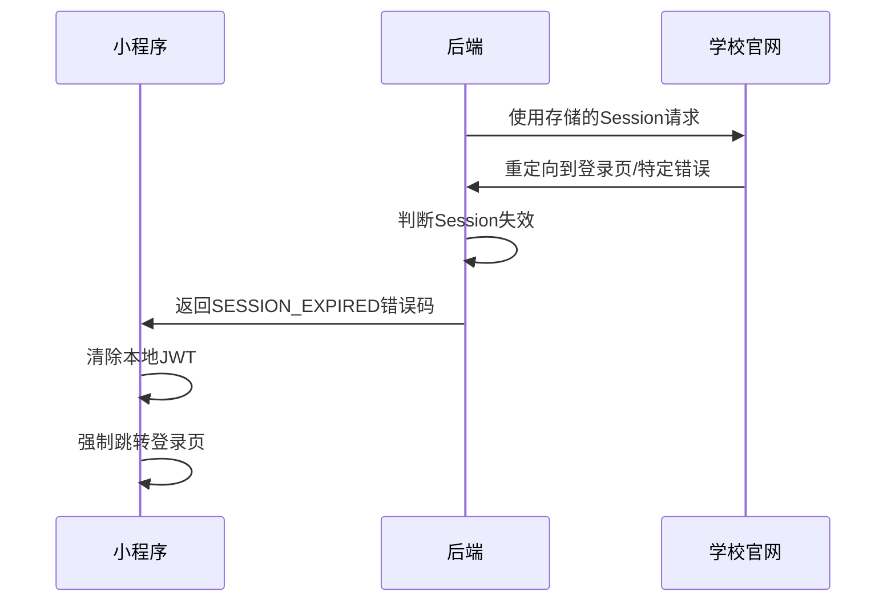

# Easy-QFNUJW 微信小程序项目设计文档

## 📋 文档信息

| 项目     | 信息               |
| -------- | ------------------ |
| **版本** | 4.0 (最终集成版)   |
| **日期** | 2025 年 8 月 16 日 |
| **状态** | 正式版             |

### 📝 修订历史

- **V1.0** - 初版构思
- **V2.0** - 确立"众包模式"以确保合规
- **V3.0** - 引入"历史参考数据"解决冷启动问题，确立混合数据模型
- **V4.0** - **最终版**，澄清并优化了班内排名功能，固化了安全架构和前后端交互模式

---

## 🎯 1. 项目概述

### 项目愿景

开发一款以学生为中心的第三方教务辅助工具，提供比官方系统更高效、更具价值的数据服务，成为学生学业规划的贴心助手。

### 目标用户

本校在读学生

### 核心价值

- 🚀 **快速查询** - 高效的数据检索体验
- 📊 **数据洞察** - 深度数据分析与展示
- 📈 **学业规划** - 智能学业辅助决策

---

## ⚡ 2. 核心功能清单

### 👤 用户中心

| 功能点           | 详细描述                             |
| ---------------- | ------------------------------------ |
| 🔐 **登录/退出** | 基于学号密码的登录认证，支持自动登录 |

### 🔍 核心查询功能

| 功能点            | 详细描述                             |
| ----------------- | ------------------------------------ |
| 📅 **课表查询**   | 周视图课表，清晰展示时间、地点、教师 |
| 🎓 **成绩查询**   | 按学期分组，展示个人完整成绩单       |
| 📊 **课余量查询** | 查询指定课程的剩余可选名额           |

### 📈 数据增强功能

| 功能点                         | 详细描述                                                                                                                       |
| ------------------------------ | ------------------------------------------------------------------------------------------------------------------------------ |
| 🧮 **绩点/均分计算**           | 自动计算总 GPA、学期/学年 GPA、加权平均分                                                                                      |
| 👨‍🏫 **教师推荐**                | 基于历史问卷数据，提供选课时对教师的评价参考                                                                                   |
| 📊 **课程成绩分析 (混合模式)** | 结合**经授权的历史参考数据**和**用户实时众包数据**，提供课程历史平均分                                                         |
| 🏆 **班内成绩分析 (个人可见)** | 基于用户授权的众包数据，为用户**单独、私密地展示**其单科成绩在班内的**百分位和精确排名**。该功能有数据量门槛，且结果仅本人可见 |

---

## 🛠️ 3. 技术架构与选型

### 🎨 前端技术栈

- **框架**: uni-app (Vue 语法)
- **编译目标**: 微信小程序、H5 等多端
- **主要平台**: 微信小程序

### ⚙️ 后端技术栈

- **语言**: Python
- **框架**: FastAPI
- **数据库**: SQLite (Session 缓存及应用数据)

### 🚀 部署架构

- **服务器**: 云服务器 (ECS)
- **反向代理**: Nginx (HTTPS 支持)
- **应用服务器**: Uvicorn

---

## 🔐 4. 认证与核心数据流

本项目采用两套独立且解耦的认证会话，确保安全性和架构清晰。

### 🔄 双重认证架构

#### 1️⃣ 小程序 ⇌ 后端认证 (JWT)

| 项目         | 说明                                                  |
| ------------ | ----------------------------------------------------- |
| **认证凭证** | JWT Token                                             |
| **流程**     | 用户在小程序端登录 → 后端验证官网凭证 → 生成 JWT 返回 |
| **安全原则** | 小程序**绝不**接触、存储学校官网 Cookie               |
| **状态管理** | 无状态，每个请求携带 JWT 校验身份                     |

#### 2️⃣ 后端 ⇌ 学校官网认证 (Session)

| 项目         | 说明                                           |
| ------------ | ---------------------------------------------- |
| **认证凭证** | Session/Cookie                                 |
| **流程**     | 后端模拟登录获取 Session → 序列化存储到 SQLite |
| **安全原则** | Session 完全封装在后端，**永不泄露**给前端     |
| **状态管理** | 有状态，后端数据库维护每个用户的官网会话       |

### ⚠️ Session 过期处理机制

| 步骤       | 操作                                                      |
| ---------- | --------------------------------------------------------- |
| **触发**   | 后端使用 Session 请求官网，收到重定向/错误响应            |
| **处理**   | 后端立即放弃请求，不尝试自动重登录                        |
| **响应**   | 返回特定错误码 `HTTP 401` + `{"code": "SESSION_EXPIRED"}` |
| **客户端** | 清除本地 JWT，强制用户重新登录                            |

---

## 🌐 5. API 接口设计 (V4.0)

### 🔑 认证接口

| 路径         | 方法   | 描述     | 请求/响应                                                                             |
| ------------ | ------ | -------- | ------------------------------------------------------------------------------------- |
| `/api/login` | `POST` | 用户登录 | **请求**: `{"student_id", "password"}` **响应**: `{"access_token", "token_type"}` |

### 📚 核心查询接口

| 路径            | 方法  | 描述         | 请求/响应                       |
| --------------- | ----- | ------------ | ------------------------------- |
| `/api/grades`   | `GET` | 获取个人成绩 | **响应**: `{"grades": [...]}`   |
| `/api/schedule` | `GET` | 获取个人课表 | **响应**: `{"schedule": [...]}` |

### 📊 统计分析接口

| 路径                           | 方法   | 描述                     | 请求/响应                                                                              |
| ------------------------------ | ------ | ------------------------ | -------------------------------------------------------------------------------------- |
| `/api/stats/course/`           | `GET`  | 查询课程综合成绩分析     | **请求**: `?course_id=xxx` **响应**: `{"historical": ..., "crowdsourced": ...}`    |
| `/api/stats/grades/contribute` | `POST` | 用户贡献个人成绩         | **请求**: `[{"course_id", "score", "class_id", ...}]`                                  |
| `/api/stats/class_rank/`       | `GET`  | 获取个人在班内的成绩分析 | **请求**: `?course_id=xxx` **响应**: `{"rank": "5 / 35", "percentile": 0.85, ...}` |

---

## 🗃️ 6. 数据库设计 (V4.0)

### 📊 数据表结构

| 表名                          | 类型       | 功能描述                                                                                          |
| ----------------------------- | ---------- | ------------------------------------------------------------------------------------------------- |
| **`users`**                   | 核心表     | 存储`openid`与`student_id`的绑定关系，包含`contribution_preference`字段记录用户数据贡献授权状态   |
| **`sessions`**                | 会话表     | 存储`student_id`与序列化后的学校官网`Session`信息                                                 |
| **`historical_course_stats`** | 历史数据表 | **[一次性导入]** 存储经授权的历史平均分数据                                                       |
| **`course_statistics`**       | 统计表     | **[持续写入]** 存储用户匿名贡献的成绩数据，包含`course_id`、`score`、`class_id`等字段用于实时计算 |

---

## 🛡️ 7. 合规与隐私保护

### 📋 法律合规要求

| 合规项目                   | 具体要求                                                                                                     |
| -------------------------- | ------------------------------------------------------------------------------------------------------------ |
| **📄 用户协议 & 隐私政策** | 必须提供完整的用户协议和隐私政策，登录前由用户明确勾选同意                                                   |
| **🔐 数据贡献授权**        | 采用**"一次性弹窗授权"**模式，获取用户单独同意。明确告知数据用途（计算平均分和个人排名），承诺匿名与安全处理 |
| **⚠️ 非官方身份声明**      | 小程序所有界面和宣传材料必须清晰标注"第三方"或"非官方"标识，避免用户产生混淆                                 |

### 🔒 安全技术保障

- **🔐 全站 HTTPS** - 确保数据传输安全
- **🚫 密码保护** - 后端绝不存储用户密码
- **📏 最小必要原则** - 严格按需收集和使用数据

---

## 🚀 8. 开发路线图 (V4.0)

### 🎯 Phase 1: MVP 核心功能 (上线可用)

**📋 主要任务**

- ✅ 完成用户登录/认证/会话管理全流程
- ✅ 实现个人成绩查询、课表查询功能
- 🌟 **[核心亮点]** 完成历史平均分数据导入与展示

**🎯 阶段目标**  
打造一个稳定、快速、有独家数据的查询工具

---

### 🎯 Phase 2: 社区化与价值深化

**📋 主要任务**

- 📊 上线"实时众包"成绩贡献与查询功能
- 🏆 上线"个人可见"班内成绩分析（排名/百分位）功能
- 👨‍🏫 上线教师推荐等其他增强功能

**🎯 阶段目标**  
引入社区共建模式，增强产品数据价值和互动性

---

### 🎯 Phase 3: 体验优化与社群引流

**📋 主要任务**

- ⚡ 优化前端缓存、加载动画、异常处理等用户体验
- 📢 在各功能点植入 QQ 群"情景化"引导入口

**🎯 阶段目标**  
提升产品流畅度和专业性，将小程序用户向私域社群转化

---

### 🎯 Phase 4: 长期运营

**📋 主要任务**

- 📈 根据 QQ 群用户反馈迭代新功能（如成绩推送）
- 🔄 持续产品运营和功能优化

**🎯 阶段目标**  
打造高黏性、高口碑的校园服务生态系统

---

## 📌 总结

本文档详细阐述了 Easy-QFNUJW 微信小程序项目的完整设计方案，涵盖了从技术架构到产品规划的各个方面。项目采用现代化的技术栈，注重安全性和用户体验，通过阶段性开发确保项目稳步推进。
